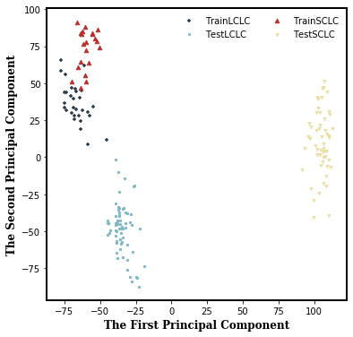

# 实战一：Logistic Regression分类预测

## 数据搜集及探索

| Sample | LCLC | SCLC |
| :--- | :---: | :---: |
| TrainDataSet | 30 例 \(RNA Count\) | 21 例 \(RNA count\) |
| TestDataSet | 66 例 \(RNA Count\) | 53 例 \(RNA FPKM\) |
| Test2DataSet | 66 例 \(RNA Count\) | 15 例 \(RNA FPKM\) |

* 转录数据只保留编码RNA，并全部转换为TPM值，然后进行log转换，以利于相互比较

> 转录组相关概念：
>
> 1. RPKM是\(Reads Per Kilobase per Million mapped reads\) 的缩写，代表每百万reads中来自于某基因每千碱基长度的reads数。RPKM是将map到基因的read数除以map到基因组上的所有read数\(以million为单位\)与RNA的长度\(以KB为单位\)
> 2. FPKM \(Fragments Per Kilobase per Million mapped reads\) 是将Map到基因的Fragments数除以Map到Genome的所有Read数\(以Million为单位\)与RNA的长度\(以KB为单位\)。
> 3. TPM \(Transcripts Per Million\) ,先除以基因长度，再除矫正后的总reads count数（即每个样本的基因 reads数除以各自长度后的累加值），会发现每个样本TPM的总和是相同的，因而TPM数值能体现出比对上某个基因的reads的比例。
>
> > FPKM与RPKM 定义类似，唯一区别是FPKM适用于双端测序文库，FPKM会将配对比对到一个片段上的两个reads计算一次。而RPKM是分开计算的，因而适用于单端测序文库。公式如下：
> >
> > $$FPKM_r = \frac{\frac{n_r}{L_{r}}*10^6}{ \sum_{i=r}^g n_r}$$ ； $$\sum_{r=i} FPKM_r = \frac{\sum_{r=i}^g\frac{n_r}{L_{r}}*10^6}{ \sum_{i=r}^g n_r}$$ ； $$TPM_r = \frac{\frac{n_r}{L_{r}}*10^6}{\sum_{r=i}^g \frac{n_r}{L_{r}}}$$
> >
> > 两者转换：

$$
\frac{FPKM_r}{\sum_{r=i}^g FPKM_r} * 10^6= \frac{\frac{n_r}{L_{r}}}{\sum_{r=i}^g \frac{n_r}{L_{r}}} * 10^6 = TPM
$$

* 查看训练集和测试集的分布情况，因特征是基因，数目太多，因而需要降维，查看在前两个主成分的分布情况

 

> 虽然四个数据集都各自聚为一类，但发现SCLC的分布训练集与测试集并不一致，有可能是因为特征值太多，因而只考虑通过文献总结的一些有差异的特征基因的降维分布情况

 

> 只考虑候选标签的分布，在测试集2的分布中，同种类型的癌症聚在一起，分布类似，因而可以用来判断模型是否过拟合。

## 特征基因筛选

进一步筛选标签，本研究的目的是筛选分子标签辅助鉴别肺癌的两个亚型，因而在应用上追求是最小的分子标签有最好的分类结果。此时候选标签较多，为了进一步筛选，对训练集中的不同亚型转录本做差异基因分析，筛选出差异表达的候选标签。

 

两种差异分析工具包，取交集，最终候选标签集合中有差异表达的基因如下；


将候选的基因标签，通过文献分为三类，先验转录组标签保留了18个基因\(如上图所示\)，先验突变基因标签保留18个，CNV变异的标签保留6个，从上图能够看出有5个基因，其在训练集和测试集的分布并不一致，占比并不高，这说明用基因的转录本做特征标签，对单个基因来讲表达趋势因为受很多因素影响，会存在一定的随机性，有可能导致模型不够准确。

## 模型训练及预测

对于分类问题，有很多模型可以采用，目前主要采用的是Logistic Regression。

在Logistic Regression模型基础上，添加了L1正则项，以利于产生稀疏系数矩阵，利于特征筛选，采用坐标轴下降法，回归交叉验证进行调参，寻找最优正则系数，代码如下，主要采用sklearn工具包。

```text
from sklearn.preprocessing import StandardScaler
from sklearn.linear_model import LogisticRegression,LogisticRegressionCV
from sklearn.metrics import roc_auc_score,roc_curve,auc
from sklearn.model_selection import cross_val_score

model = LogisticRegressionCV(Cs=np.logspace(-2, 2, 20), 
        solver='liblinear',cv=10,penalty='l1',
        max_iter=5000,class_weight='balanced')

fig = plt.figure(figsize=(20,5))
transcoef = []
mutcoef = []
cnvcoef = []

for n,i in enumerate([trans,mut,cnv]):
    model.fit(Train.loc[:,i],Train['Cancer'])
    test_predict = model.predict_proba(Test.loc[:,i])
    test_predict2 = model.predict_proba(Test2.loc[:,i])
    fpr, tpr, thresholds = roc_curve(Test['Cancer'], y_score=test_predict[:,1], pos_label=1)
    fpr2, tpr2, thresholds2 = roc_curve(Test2['Cancer'], y_score=test_predict2[:,1], pos_label=1)
    roc_auc= auc(fpr, tpr)
    roc_auc2= auc(fpr2, tpr2)
    test_auc = roc_auc_score(Test['Cancer'], y_score=test_predict[:,1])
    lw = 2
    ax = plt.subplot(1,3,n+1)
    ax.plot(fpr, tpr, color='darkorange',lw=lw, label='Test_ROC curve (area = %0.3f)' %roc_auc)
    ax.plot(fpr2, tpr2, color='#6e8cbe',lw=lw, label='Test2_ROC curve (area = %0.3f)' %roc_auc2)
    print (test_auc)
    ax.plot([0, 1], [0, 1], color='navy', lw=lw, linestyle='--')
    ax.set_xlim([0.0, 1.0])
    ax.set_ylim([0.0, 1.05])
    ax.set_xlabel('False Positive Rate')
    ax.set_ylabel('True Positive Rate')
    if n == 0:
        title = 'Transcript Candidate Genes'
        transcoef = model.coef_
    elif n == 1:
        title = 'Mutation Candidate Genes'
        mutcoef = model.coef_
    elif n == 2:
        title = 'CNV Candidate Genes'
        cnvcoef = model.coef_
    ax.set_title(title)
    ax.legend(loc="lower right")
```

结果如下:


会发现，先验的转录差异的候选标签，CNV候选标签效果较好，突变候选标签几乎没有分类效果，This is rational，因为用的是转录数据，CNV变化有可能影响转录本的差异，而突变并不一定会导致转录水平的变化，所以候选标签采用Trans和CNV基因集合。

最终将Trans和CNV系数不为0的基因合并到一起，再进行一次拟合和预测，下图为预测结果，在两个测试集中AUC都在80%以上，模型效果还可以。最终找出了9个基因分子标签，以用来辅助鉴别肺癌分型。


