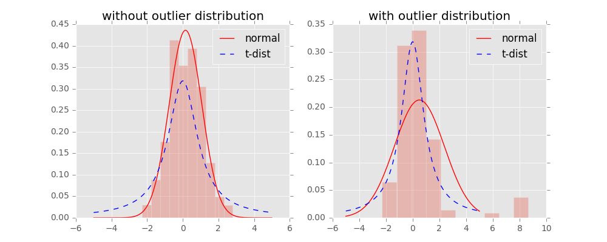

# 非负矩阵分解

        对于任意给定的一个非负矩阵V，NMF算法能够寻找到一个非负矩阵W和一个非负矩阵H，使得满足，从而将一个非负的矩阵分解为左右两个非负矩阵的乘积。[如此图所示](https://pic2.zhimg.com/v2-e9491ec05171bc97e89402350c0e02d5_b.png)，其中约束条件即要求分解后的矩阵H和W都必须是非负矩阵。



$$
V_{fn} \approx  W_{fk}H_{kn}; s.t. \left\{\begin{array}{c} W_{fk} > 0 \\H_{kn} > 0 \end{array}\right.
$$

因 $$v = Wh$$ ；v是V中的一个列向量，h是H对应的一个列向量，即可将v中的每一个元素，看做W中对应的基向量（行）与h的乘积，因而H可看做是系数矩阵。要达到降维的目的，则取决于k的取值，即v中每一个元素，可以看做是W中对应行向量分解成k个特征值的线性组合，

> 从多元统计的观点看，NMF是在非负性的限制下，在尽可能保持信息不变的情况下，将高维的随机模式简化为低维的随机模式H，而这种简化的基础是估计出数据中的本质结构W；从代数的观点看，NMF是发现数据的一种内在非负\(或蕴涵更多性质的\)代数分解形式或表示方法；从维数约减的观点看，因为基矩阵W和系数矩阵H同时由NMF来确定，系数矩阵H并非为数据矩阵V在W上的投影，所以NMF实现的是非线性的维数约减

**之所以是约等于，是因为NMF求解的并非精确解，只是数值上的近似解**

因而优化目标即为

$$
min  \sum_{ij}(V_{ij}-V_{ij}^{'}) = min(||E = V-WH||^2 )
$$

寻找损失函数：

* **假设** $$E \sim N(WH,\sigma^2)$$ ，**应用最大似然法求解**

$$
L(W,H) = \prod_{i,j}\frac{1}{\sqrt{2\pi}\sigma_{ij}}e^{-\frac{E_{ij}^2}{2\sigma_{ij}}} = \prod_{i,j}\frac{1}{\sqrt{2\pi}\sigma_{ij}}e^{-\frac{(V_{ij}-(WH)_{ij})^2}{2\sigma_{ij}}}
$$

取对数后的似然函数：

$$
lnL(W,H) = \sum_{i,j}ln\frac{1}{\sqrt{2\pi}\sigma_{ij}}-\frac{\sum_{i,j}(V_{ij}-(WH)_{ij})^2}{2\sigma_{ij}}
$$

故要似然函数值最大，等价于 $$\sum_{i,j}(V_{ij}-(WH)_{ij})^2$$ 最小。

故损失函数为 \(1/2便于求导\)

$$
J(W,H) = \frac{1}{2}\sum_{i,j}(V_{ij}-(WH)_{ij})^2
$$

又因为

$$
(WH)_{ij} = \sum_kW_{ik}H_{kj} \Rightarrow \frac{\partial(WH)_{ij}}{\partial W_{ik}} = H_{kj}
$$

故

$$
\frac{\partial(J(W,H))}{\partial W_{ik}} = \sum_j(H_{kj}(V_{ij}-(WH)_{ij})) = \sum_j V_{ij}H_{kj}-\sum_j(WH)_{ij}H_{kj}
$$

进而推导出

$$
\frac{\partial(J(W,H))}{\partial W_{ik}} = (VH^T)_{ik}-(WHH^T)_{ik}
$$

同理有

$$
\frac{\partial(J(W,H))}{\partial H_{kj}} = (W^TV)_{kj}-(W^TWH)_{kj}
$$

梯度下降进行迭代，如下：

$$
W_{ik} = W_{ik} - \alpha_1*[(VH^T)_{ik}-(WHH^T)_{ik}]
$$

$$
H_{kj} = H_{kj} - \alpha_2*[(W^TV)_{kj}-(W^TWH)_{kj}]
$$

其中 $$\alpha_1,\alpha_2$$ 为步长，如果选取

$$
\alpha_1 = \frac{W_{ik}}{(W^TWH)_{ik}}; \alpha_2 =  \frac{H_{kj}}{(WHH^T)_{kj}}
$$

最终得到的迭代式子为

$$
W_{ik} = W_{ik}*\frac{(VH^T)_{ik}}{(WHH^T)_{ik}}
$$

$$
H_{kj} = H_{kj}*\frac{(W^TV)_{kj}}{(W^TWH)_{kj}}
$$

* **假设服从泊松分布**  

[KL散度，信息熵，作为损失函数](https://www.cnblogs.com/xingshansi/p/6672908.html)

$$
J(W,H) = \sum_{i,j}[V_{ij}ln\frac{V_{ij}}{(WH)_{ij}}-V_{ij}+(WH)_{ij}]
$$

经过推导得到:

$$
W_{ik} = W_{ik}\frac{\sum_j[H_{kj}V_{ij}/(WH)_{ij}]}{\sum_jH_{kj}}
$$

$$
H_{kj} = H_{kj}\frac{\sum_i[W_{ik}V_{ij}/(WH)_{ij}]}{\sum_iW_{ik}}
$$

#### python代码，欧氏距离，梯度下降

```text
def train(V, components, iternum, e):
    '''
    非负矩阵分解函数
    :param V:  原始矩阵
    :param components:  要提取多少个特征
    :param iternum: 迭代次数
    :param e: 误差阈值
    :return:
    '''
    V = V.T
    m, n = V.shape # 4096 * 64
    # 随机初始化两个矩阵
    W = np.random.random((m, components)) # 4096 * 8
    H = np.random.random((components, n)) # 8 * 64


    # 迭代计算过程，循环中使用了numpy的切片操作，可以避免直接使用Python的多重循环，从而提高了运行速度
    for iter in range(iternum):
        V_pre = np.dot(W, H)
        E = V - V_pre

        err = np.sum(E * E)
        print(err)
        if err < e:
            break
        # 对照更新公式
        a = np.dot(W.T, V)
        b = np.dot(W.T, np.dot(W, H))
        H[b != 0] = (H * a / b)[b != 0]

        c = np.dot(V, H.T)
        d = np.dot(W, np.dot(H, H.T))

        W[d != 0] = (W * c / d)[d != 0]
    return W, H
```

