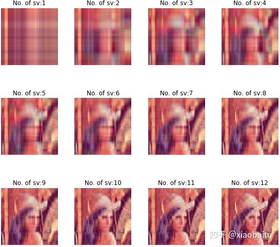

# 实战二：SVD与NMF

###  **SVD 应用实例：**

对lena进行图片压缩


代码如下（网上搜寻），该图片实质可以看成（512，512，4）的一个3维矩阵，每一个元素为4个元素的数组，表示红，绿，蓝，灰度。

```text
import numpy as np
import os
from PIL import Image
import matplotlib.pyplot as plt
import matplotlib as mpl
from pprint import pprint

def restore(sigma, u, v, K):  # 奇异值、左特征向量、右特征向量
    m = u.shape[0]
    n = v.shape[0]
    a = np.zeros((m, n))

    for k in range(K):
        uk = u[:, k].reshape(m, 1)
        vk = v[k].reshape(1, n)
        a += sigma[k] * np.dot(uk, vk)  #    通过秩逼近，近似原矩阵

    # clip这个函数将将数组中的元素限制在a_min, a_max之间，
    # 大于a_max的就使得它等于 a_max，小于a_min,的就使得它等于a_min
    a = a.clip(0, 255)
    return np.rint(a).astype('uint8')


if __name__ == "__main__":
    print(os.getcwd())

    A = Image.open("./lena.jpg", 'r')
    print(A)

    output_path = './lena_output'
    if not os.path.exists(output_path):
        os.mkdir(output_path)

    a = np.array(A)
    #进行SVD分解
    u_r, sigma_r, v_r = np.linalg.svd(a[:, :, 0])
    u_g, sigma_g, v_g = np.linalg.svd(a[:, :, 1])
    u_b, sigma_b, v_b = np.linalg.svd(a[:, :, 2])

    plt.figure(figsize=(8, 8), facecolor='w')

    # matploblib 解决中文显示的问题
    mpl.rcParams['font.sans-serif'] = ['simHei']
    mpl.rcParams['axes.unicode_minus'] = False

    # 分别获取1到num个奇异值恢复图像
    num = 20
    sigma = 0
    for k in range(1, num+1):
        R = restore(sigma_r, u_r, v_r, k)
        G = restore(sigma_g, u_g, v_g, k)
        B = restore(sigma_b, u_b, v_b, k)
        sigma += sigma_r[k]
        # (512, 512)
        # 增加了一个维度，这个维度上的索引0，1，2分别存放R，G，B
        # axis从0开始索引，2表示第三个维度
        I = np.stack((R, G, B), axis=2)
        # (512,512,3)
        print(I.shape)

        # 将array保存为三通道彩色图像
        Image.fromarray(I).save('%s/svd_%d.png' % (output_path, k))

        # 按照三行四列显示前12图像
        if k <= 12:
            plt.subplot(3, 4, k)
            plt.imshow(I)
            plt.axis('off')
            plt.title('奇异值个数：%d' % k)
    print (sigma/sum(sigma_r)) 
    plt.suptitle('SVD与图像分解', fontsize=20)
    plt.tight_layout(0.3, rect=(0, 0, 1, 0.92))
    plt.show()
```

输出图片为：



前12个奇异向量已经能很好的保存图片的特征，在512个奇异值中，前20个奇异值（3.9%）所占比为0.29956，奇异值的贡献度减少的很快，一般前10%的奇异值就有99%以上的贡献度。

在实战过程中，想到既然是方阵，用特征值分解是什么样子，因而将代码进行了修改

```text
u_r, sigma_r, v_r = np.linalg.svd(a[:, :, 0])
u_g, sigma_g, v_g = np.linalg.svd(a[:, :, 1])
u_b, sigma_b, v_b = np.linalg.svd(a[:, :, 2])


更改为：
sigma_r, u_r = np.linalg.eig(a[:, :, 0])
#求逆
v_r = np.matrix(u_r).I
sigma_g, u_g = np.linalg.eig(a[:, :, 1])
v_g = np.matrix(u_g).I
sigma_b, u_b = np.linalg.eig(a[:, :, 2])
v_b = np.matrix(u_b).I
```

但报错，因为特征值有虚数，故也可看出，特征值分解有其局限性。

### **NMF 应用实例：寻找癌症的突变特征**

\*\*\*\*

