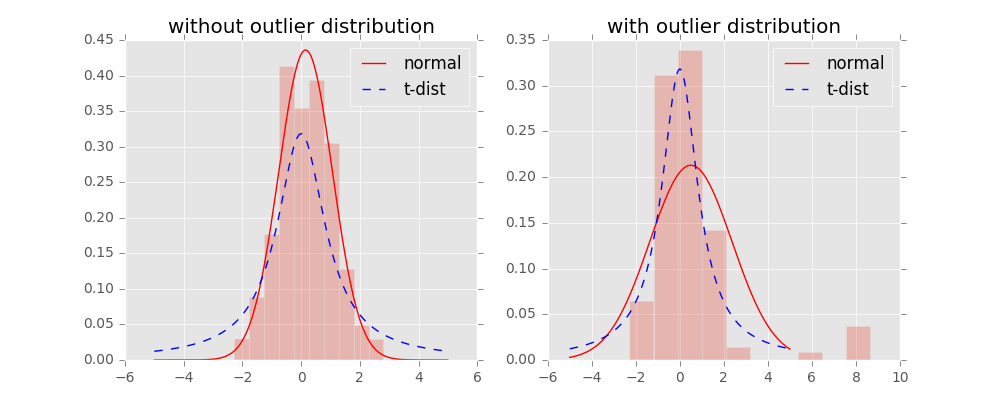

# T分布随机邻接嵌入

#### [复制的网上资料](http://www.datakit.cn/blog/2017/02/05/t_sne_full.html)

#### 参考： [1](https://www.cnblogs.com/bonelee/p/7849867.html)，[2](http://lvdmaaten.github.io/tsne/)

### 介绍

t-SNE\(t-distributed stochastic neighbor embedding\)是用于**降维**的一种机器学习算法，是由 Laurens van der Maaten 和 Geoffrey Hinton在08年提出来。此外，**t-SNE 是一种非线性降维算法**，非常适用于高维数据降维到2维或者3维，进行可视化。

t-SNE是由SNE\(Stochastic Neighbor Embedding, SNE; Hinton and Roweis, 2002\)发展而来。


图中基本上包括了大多数流形学习方法，不过这里面没有t-SNE,相比于其他算法，t-SNE算是比较新的一种方法，也是效果比较好的一种方法。

假设数据是均匀采样于一个高维欧氏空间中的低维流形，流形学习就是从高维采样数据中恢复低维流形结构，即找到高维空间中的低维流形，并求出相应的嵌入映射，以实现维数约简或者数据可视化。它是从观测到的现象中去寻找事物的本质，找到产生数据的内在规律。能够承载更复杂的映射，提供更好的可视化方法

T-SNE的思想是找到数据的一种二维表达方式，同时能够尽可能地保持点与点之间的距离。T-SNE从每个数据点的随机二维表示开始，然后尝试使在原始特征空间中更接近的点更靠近，并且在原始特征空间中相距很远的点更远。T-SNE更强调靠近的点，而不是保存远点之间的距离。换句话说，它试图保存哪些点是彼此相邻的信息。

十多种算法，降维结果各有好坏，总体上t-SNE表现最优，但它的计算复杂度也是最高的。

### SNE

**基本原理**：

通过仿射\(affinitie\)变换将数据点映射到概率分布上，主要包括两个步骤：

* SNE构建一个高维对象之间的概率分布，使得相似的对象有更高的概率被选择，而不相似的对象有较低的概率被选择。
* SNE在低维空间里在构建这些点的概率分布，使得这两个概率分布之间尽可能的相似。

我们看到t-SNE模型是非监督的降维，他跟k-means等不同，他不能通过训练得到一些东西之后再用于其它数据（比如kmeans可以通过训练得到k个点，再用于其它数据集，而t-SNE只能单独的对数据做操作，也就是说他只有fit\_transform，而没有fit操作）

**SNE原理推导：**

SNE是先将欧几里得距离转换为条件概率来表达点与点之间的相似度。具体来说，给定一个N个高维的数据 $$x_1,...,x_N$$ （注意$$N$$不是维度）, t-SNE首先是计算概率$$p_{ij}$$，正比于$$x_i$$和$$x_j$$之间的相似度（这种概率是我们自主构建的），即：

$$
{p_ {j \mid i} = \frac{\exp(- \mid  \mid  x_i -x_j  \mid  \mid  ^2 / (2 \sigma^2_i ))} {\sum_{k \neq i} \exp(- \mid  \mid  x_i - x_k  \mid  \mid  ^2 / (2 \sigma^2_i))}}
$$

这里的有一个参数是$$σ_i$$，对于不同的点$$x_i$$取值不一样，后续会讨论如何设置。此外设置$$p_{x_i∣x_i}=0$$,因为我们关注的是两两之间的相似度。那对于低维度下的$$y_i$$，我们可以指定高斯分布的方差为 $$\frac{1}{\sqrt{2}}$$ ，因此它们之间的相似度如下:

$$
{q_ {j \mid i} = \frac{\exp(- \mid  \mid  x_i -x_j  \mid  \mid  ^2)} {\sum_{k \neq i} \exp(- \mid  \mid  x_i - x_k  \mid  \mid  ^2)}}
$$

同样，设定 $$q_{i \mid i} = 0$$ ，如果降维的效果比较好，局部特征保留完整，那么 $$p_{i \mid j} = q_{i \mid j}$$ , 因此我们优化两个分布之间的距离-KL散度\(Kullback-Leibler divergences\)，那么目标函数\(cost function\)如下:

$$
C = \sum_i KL(P_i  \mid  \mid  Q_i) = \sum_i \sum_j p_{j \mid i} \log \frac{p_{j \mid i}}{q_{j \mid i}}
$$

 这里的$$P_i$$表示了给定点$$x_i$$下，其他所有数据点的条件概率分布。需要注意的是**KL散度具有不对称性**，

> 相对熵（relative entropy），又被称为Kullback-Leibler散度（Kullback-Leibler divergence）或信息散度（information divergence），是两个[概率分布](https://baike.baidu.com/item/%E6%A6%82%E7%8E%87%E5%88%86%E5%B8%83/828907)（probability distribution）间差异的非对称性度量 。在在[信息理论](https://baike.baidu.com/item/%E4%BF%A1%E6%81%AF%E7%90%86%E8%AE%BA/2424000)中，相对熵等价于两个概率分布的[信息熵](https://baike.baidu.com/item/%E4%BF%A1%E6%81%AF%E7%86%B5/7302318)（Shannon entropy）的差值。
>
>  在信息理论中，相对熵是用来度量使用基于 的编码来编码来自 的样本平均所需的额外的比特个数。典型情况下， 表示数据的真实分布， 表示数据的理论分布，模型分布，或 的近似分布。给定一个字符集的概率分布，我们可以设计一种编码，使得表示该字符集组成的字符串平均需要的比特数最少。假设这个字符集是 ，对 ，其出现概率为 ，那么其最优编码平均需要的比特数等于这个字符集的熵： $$H(x) = \sum_{x \in X} P(x) \log  \frac{1}{P(x)}$$ 
>
> ；在同样的字符集上，假设存在另一个概率分布 ，如果用概率分布 的最优编码（即字符 的编码长度等于 ），来为符合分布 的字符编码，那么表示这些字符就会比理想情况多用一些比特数。相对熵就是用来衡量这种情况下平均每个字符多用的比特数，因此可以用来衡量两个分布的距离，即： $$KL(P||Q)=- \sum_{x \in X} P(x) \log  \frac{1}{P(x)} + \sum_{x \in X} P(x) \log  \frac{1}{Q(x)} = \sum_{x \in X} P(x) \log  \frac{P(x)}{Q(x)}$$

在低维映射中不同的距离对应的惩罚权重是不同的，具体来说：距离较远的两个点来表达距离较近的两个点会产生更大的cost，相反，用较近的两个点来表达较远的两个点产生的cost相对较小\(注意：类似于回归容易受异常值影响，但效果相反\)。即用较小的$$ q_{j∣i}=0.2$$ 来建模较大的 $$p_{j∣i}=0.8$$, $$cost = p \log(\frac{p}{q}) = 1.11$$ ,同样用较大的$$q_{j∣i}=0.8$$来建模较大的$$p_{j∣i}=0.2$$, cost=-0.277, 因此，**SNE会倾向于保留数据中的局部特征**。

**推导SNE**

不同的点具有不同的$$σ_i$$，$$P_i$$的熵\(entropy\)会随着$$σ_i$$的增加而增加。SNE使用困惑度\([perplexity](https://en.wikipedia.org/wiki/Perplexity)\)的概念，用二分搜索的方式来寻找一个最佳的$$σ$$。其中困惑度指:

$$
Perp(P_i) = 2^{H(P_i)}
$$

这里的$$H(P_i)$$是$$P_i$$的熵，即:

$$
H(P_i) = -\sum_j p_{j \mid i} \log_2 p_{j \mid i}
$$

 困惑度可以解释为一个点附近的有效近邻点个数。**SNE对困惑度的调整比较有鲁棒性，通常选择5-50之间**，给定之后，使用二分搜索的方式寻找合适的σ。

那么核心问题是如何求解梯度了,目标函数等价于$$∑∑−plog(q)$$这个式子与softmax非常的类似，我们知道softmax的目标函数是$$∑−ylogp$$，对应的梯度是$$y−p$$\(注：这里的softmax中y表示label，p表示预估值\)。 同样我们可以推导SNE的目标函数中的i在j下的条件概率情况的梯度是$$2(p_{i∣j}−q_{i∣j})(y_i−y_j)$$， 同样j在i下的条件概率的梯度是 $$2(p_{i \mid j}-q_{i \mid j})(y_i-y_j)$$ , 最后得到完整的梯度公式如下:

$$
\frac{\delta C}{\delta y_i} = 2 \sum_j (p_{j \mid i} - q_{j \mid i} + p_{i \mid j} - q_{i \mid j})(y_i - y_j)
$$

在初始化中，可以用较小的σ下的高斯分布来进行初始化。为了加速优化过程和避免陷入局部最优解，梯度中需要使用一个相对较大的动量\(momentum\)。即参数更新中除了当前的梯度，还要引入之前的梯度累加的指数衰减项，如下:

$$
Y^{(t)} = Y^{(t-1)} + \eta \frac{\delta C}{\delta Y} + \alpha(t)(Y^{(t-1)} - Y^{(t-2)})
$$

这里的$$Y(t)$$表示迭代t次的解，$$η$$表示学习速率,$$α(t)$$表示迭代t次的动量。

此外，在初始优化的阶段，每次迭代中可以引入一些高斯噪声，之后像模拟退火一样逐渐减小该噪声，可以用来避免陷入局部最优解。因此，SNE在选择高斯噪声，以及学习速率，什么时候开始衰减，动量选择等等超参数上，需要跑多次优化才可以。

### T-SNE

尽管SNE提供了很好的可视化方法，但是他很难优化，而且存在”crowding problem”\(拥挤问题\)。后续中，Hinton等人又提出了t-SNE的方法。与SNE不同，主要如下:

* 使用对称版的SNE，简化梯度公式
* 低维空间下，使用t分布替代高斯分布表达两点之间的相似度

t-SNE在低维空间下使用更重长尾分布的t分布来避免crowding问题和优化问题。在这里，首先介绍一下对称版的SNE，之后介绍crowding问题，之后再介绍t-SNE。

**Symmetric SNE**

优化$$p_{i∣j}$$和$$q_{i∣j}$$的KL散度的一种替换思路是，使用联合概率分布来替换条件概率分布，即P是高维空间里各个点的联合概率分布，Q是低维空间下的，目标函数为:

$$
C = KL(P \mid  \mid Q) = \sum_i \sum_j p_{i,j} \log \frac{p_{ij}}{q_{ij}}
$$

这里的$$p_{ii}$$,$$q_{ii}$$为0，我们将这种SNE称之为symmetric SNE\(对称SNE\)，因为他假设了对于任意$$i,p_{ij}=p_{ji},q_{ij}=q_{ji}$$，因此概率分布可以改写为:

$$
p_{ij} = \frac{\exp(- \mid  \mid x_i - x_j \mid  \mid ^2 / 2\sigma^2)}{\sum_{k \neq l} \exp(- \mid  \mid x_k-x_l \mid  \mid ^2 / 2\sigma^2)}  \ \ \ \  q_{ij} = \frac{\exp(- \mid  \mid y_i - y_j \mid  \mid ^2)}{\sum_{k \neq l} \exp(- \mid  \mid y_k-y_l \mid  \mid ^2)}
$$

 这种表达方式，使得整体简洁了很多。但是会引入**异常值**的问题。比如$$x_i$$是异常值，那么$$∣∣xi−xj∣∣^2$$会很大，对应的所有的j, $$p_{ij}p_{ij}$$都会很小\(之前是仅在$$x_i$$下很小\)，导致低维映射下的$$y_i$$对cost影响很小。

为了解决这个问题，我们将联合概率分布定义修正为: $$p_{ij} = \frac{p_{i \mid j} + p_{j \mid i}}{2}$$ 这保证了 $$\sum_j p_{ij} \gt \frac{1}{2n}$$ 使得每个点对于cost都会有一定的贡献。对称SNE的最大优点是梯度计算变得简单了，如下:

$$
\frac{\delta C}{\delta y_i} = 4 \sum_j (p_{ij} - q_{ij})(y_i - y_j)
$$

 实验中，发现对称SNE能够产生和SNE一样好的结果，有时甚至略好一点。

**Crowding问题**

拥挤问题就是说各个簇聚集在一起，无法区分。比如有一种情况，高维度数据在降维到10维下，可以有很好的表达，但是降维到两维后无法得到可信映射，比如降维如10维中有11个点之间两两等距离的，在二维下就无法得到可信的映射结果\(最多3个点\)。 进一步的说明，假设一个以数据点$$x_i$$为中心，半径为r的m维球\(三维空间就是球\)，其体积是按$$r^m$$增长的，假设数据点是在m维球中均匀分布的，我们来看看其他数据点与$$x_i$$的距离随维度增大而产生的变化。


从上图可以看到，随着维度的增大，大部分数据点都聚集在m维球的表面附近，与点xi的距离分布极不均衡。如果直接将这种距离关系保留到低维，就会出现拥挤问题。

Cook et al.\(2007\) 提出一种slight repulsion的方式，在基线概率分布\(uniform background\)中引入一个较小的混合因子$$ρ$$,这样$$q_{ij}$$就永远不会小于 $$\frac{2 \rho}{n(n-1)}$$  \(因为一共了$$n(n-1)$$个pairs\)，这样在高维空间中比较远的两个点之间的$$q_{ij}$$总是会比$$p_{ij}$$大一点。这种称之为UNI-SNE，效果通常比标准的SNE要好。优化UNI-SNE的方法是先让ρ为0，使用标准的SNE优化，之后用模拟退火的方法的时候，再慢慢增加ρ. 直接优化UNI-SNE是不行的\(即一开始ρ不为0\)，因为距离较远的两个点基本是一样的qij\(等于基线分布\), 即使pij很大，一些距离变化很难在$$q_{ij}$$中产生作用。也就是说优化中刚开始距离较远的两个聚类点，后续就无法再把他们拉近了。

**t-SNE**

对称SNE实际上在高维度下 另外一种减轻”拥挤问题”的方法：在高维空间下，在高维空间下我们使用高斯分布将距离转换为概率分布，在低维空间下，我们使用更加偏重长尾分布的方式来将距离转换为概率分布，使得高维度下中低等的距离在映射后能够有一个较大的距离。



对比一下高斯分布和t分布**,** t分布受异常值影响更小，拟合结果更为合理，较好的捕获了数据的整体特征。

使用了t分布之后的q变化，如下:

$$
q_{ij} = \frac{(1 +  \mid  \mid y_i -y_j \mid  \mid ^2)^{-1}}{\sum_{k \neq l} (1 +  \mid  \mid y_i -y_j \mid  \mid ^2)^{-1}}
$$

此外，t分布是无限多个高斯分布的叠加，计算上不是指数的，会方便很多。优化的梯度如下:

$$
\frac{\delta C}{\delta y_i} = 4 \sum_j(p_{ij}-q_{ij})(y_i-y_j)(1+ \mid  \mid y_i-y_j \mid  \mid ^2)^{-1}
$$


t-sne的有效性，也可以从上图中看到：横轴表示距离，纵轴表示相似度, 可以看到，对于较大相似度的点，t分布在低维空间中的距离需要稍小一点；而对于低相似度的点，t分布在低维空间中的距离需要更远。这恰好满足了我们的需求，即同一簇内的点\(距离较近\)聚合的更紧密，不同簇之间的点\(距离较远\)更加疏远。

总结一下，t-SNE的梯度更新有两大优势：

* 对于不相似的点，用一个较小的距离会产生较大的梯度来让这些点排斥开来。
* 这种排斥又不会无限大\(梯度中分母\)，避免不相似的点距离太远。

**算法过程**

\*\*\*\*

算法详细过程如下：

* Data: $$X=x_1,...,x_n$$
* 计算cost function的参数：困惑度Perp
* 优化参数: 设置迭代次数T， 学习速率η, 动量α\(t\)
* 目标结果是低维数据表示 $$Y^T=y_1,...,y_n$$
* 开始优化
  * 计算在给定Perp下的条件概率$$p_{j∣i}$$\(参见上面公式\)
  * 令 $$p_{ij} = \frac{p_{j \mid i} + p_{i \mid j}}{2n}$$ 
  * 用 $$N(0, 10^{-4}I)$$ 随机初始化 Y
  * 迭代，从 t = 1 到 T， 做如下操作:
    * 计算低维度下的 qijqij\(参见上面的公式\)
    * 计算梯度（参见上面的公式）
    * 更新 $$Y^{t} = Y^{t-1} + \eta \frac{dC}{dY} + \alpha(t)(Y^{t-1} - Y^{t-2})$$ 
  * 结束
* 结束

优化过程中可以尝试的两个trick:

* 提前压缩\(early compression\):开始初始化的时候，各个点要离得近一点。这样小的距离，方便各个聚类中心的移动。可以通过引入L2正则项\(距离的平方和\)来实现。
* 提前夸大\(early exaggeration\)：在开始优化阶段，$$p_{ij}$$乘以一个大于1的数进行扩大，来避免因为$$q_{ij}$$太小导致优化太慢的问题。比如前50次迭代，$$p_{ij}$$乘以4


**不足**

主要不足有四个:

* 主要用于可视化，很难用于其他目的。比如测试集合降维，因为他没有显式的预估部分，不能在测试集合直接降维；比如降维到10维，因为t分布偏重长尾，1个自由度的t分布很难保存好局部特征，可能需要设置成更高的自由度。
* t-SNE倾向于保存局部特征，对于本征维数\(intrinsic dimensionality\)本身就很高的数据集，是不可能完整的映射到2-3维的空间
* t-SNE没有唯一最优解，且没有预估部分。如果想要做预估，可以考虑降维之后，再构建一个回归方程之类的模型去做。但是要注意，$$t-sne中距离本身是没有意义，都是概率分布问题$$。
* 训练太慢。有很多基于树的算法在t-sne上做一些改进

**t-sne的完整代码实现**:

```text
# coding utf-8
'''
代码参考了作者Laurens van der Maaten的开放出的t-sne代码, 并没有用类进行实现,主要是优化了计算的实现
'''
import numpy as np


def cal_pairwise_dist(x):
    '''计算pairwise 距离, x是matrix
    (a-b)^2 = a^w + b^2 - 2*a*b
    '''
    sum_x = np.sum(np.square(x), 1)
    dist = np.add(np.add(-2 * np.dot(x, x.T), sum_x).T, sum_x)
    return dist


def cal_perplexity(dist, idx=0, beta=1.0):
    '''计算perplexity, D是距离向量，
    idx指dist中自己与自己距离的位置，beta是高斯分布参数
    这里的perp仅计算了熵，方便计算
    '''
    prob = np.exp(-dist * beta)
    # 设置自身prob为0
    prob[idx] = 0
    sum_prob = np.sum(prob)
    perp = np.log(sum_prob) + beta * np.sum(dist * prob) / sum_prob
    prob /= sum_prob
    return perp, prob


def seach_prob(x, tol=1e-5, perplexity=30.0):
    '''二分搜索寻找beta,并计算pairwise的prob
    '''

    # 初始化参数
    print("Computing pairwise distances...")
    (n, d) = x.shape
    dist = cal_pairwise_dist(x)
    pair_prob = np.zeros((n, n))
    beta = np.ones((n, 1))
    # 取log，方便后续计算
    base_perp = np.log(perplexity)

    for i in range(n):
        if i % 500 == 0:
            print("Computing pair_prob for point %s of %s ..." %(i,n))

        betamin = -np.inf
        betamax = np.inf
        perp, this_prob = cal_perplexity(dist[i], i, beta[i])

        # 二分搜索,寻找最佳sigma下的prob
        perp_diff = perp - base_perp
        tries = 0
        while np.abs(perp_diff) > tol and tries < 50:
            if perp_diff > 0:
                betamin = beta[i].copy()
                if betamax == np.inf or betamax == -np.inf:
                    beta[i] = beta[i] * 2
                else:
                    beta[i] = (beta[i] + betamax) / 2
            else:
                betamax = beta[i].copy()
                if betamin == np.inf or betamin == -np.inf:
                    beta[i] = beta[i] / 2
                else:
                    beta[i] = (beta[i] + betamin) / 2

            # 更新perb,prob值
            perp, this_prob = cal_perplexity(dist[i], i, beta[i])
            perp_diff = perp - base_perp
            tries = tries + 1
        # 记录prob值
        pair_prob[i,] = this_prob
    print("Mean value of sigma: ", np.mean(np.sqrt(1 / beta)))
    return pair_prob


def pca(x, no_dims = 50):
    ''' PCA算法
    使用PCA先进行预降维
    '''
    print("Preprocessing the data using PCA...")
    (n, d) = x.shape
    x = x - np.tile(np.mean(x, 0), (n, 1))
    l, M = np.linalg.eig(np.dot(x.T, x))
    y = np.dot(x, M[:,0:no_dims])
    return y


def tsne(x, no_dims=2, initial_dims=50, perplexity=30.0, max_iter=1000):
    """Runs t-SNE on the dataset in the NxD array x
    to reduce its dimensionality to no_dims dimensions.
    The syntaxis of the function is Y = tsne.tsne(x, no_dims, perplexity),
    where x is an NxD NumPy array.
    """

    # Check inputs
    if isinstance(no_dims, float):
        print("Error: array x should have type float.")
        return -1
    if round(no_dims) != no_dims:
        print("Error: number of dimensions should be an integer.")
        return -1

    # 初始化参数和变量
    x = pca(x, initial_dims).real
    (n, d) = x.shape
    initial_momentum = 0.5
    final_momentum = 0.8
    eta = 500
    min_gain = 0.01
    y = np.random.randn(n, no_dims)
    dy = np.zeros((n, no_dims))
    iy = np.zeros((n, no_dims))
    gains = np.ones((n, no_dims))

    # 对称化
    P = seach_prob(x, 1e-5, perplexity)
    P = P + np.transpose(P)
    P = P / np.sum(P)
    # early exaggeration
    P = P * 4
    P = np.maximum(P, 1e-12)

    # Run iterations
    for iter in range(max_iter):
        # Compute pairwise affinities
        sum_y = np.sum(np.square(y), 1)
        num = 1 / (1 + np.add(np.add(-2 * np.dot(y, y.T), sum_y).T, sum_y))
        num[range(n), range(n)] = 0
        Q = num / np.sum(num)
        Q = np.maximum(Q, 1e-12)

        # Compute gradient
        PQ = P - Q
        for i in range(n):
            dy[i,:] = np.sum(np.tile(PQ[:,i] * num[:,i], (no_dims, 1)).T * (y[i,:] - y), 0)

        # Perform the update
        if iter < 20:
            momentum = initial_momentum
        else:
            momentum = final_momentum
        gains = (gains + 0.2) * ((dy > 0) != (iy > 0)) + (gains * 0.8) * ((dy > 0) == (iy > 0))
        gains[gains < min_gain] = min_gain
        iy = momentum * iy - eta * (gains * dy)
        y = y + iy
        y = y - np.tile(np.mean(y, 0), (n, 1))
        # Compute current value of cost function
        if (iter + 1) % 100 == 0:
            if iter > 100:
                C = np.sum(P * np.log(P / Q))
            else:
                C = np.sum( P/4 * np.log( P/4 / Q))
            print("Iteration ", (iter + 1), ": error is ", C)
        # Stop lying about P-values
        if iter == 100:
            P = P / 4
    print("finished training!")
    return y


if __name__ == "__main__":
    # Run Y = tsne.tsne(X, no_dims, perplexity) to perform t-SNE on your dataset.
    X = np.loadtxt("mnist2500_X.txt")
    labels = np.loadtxt("mnist2500_labels.txt")
    Y = tsne(X, 2, 50, 20.0)
    from matplotlib import pyplot as plt
    plt.scatter(Y[:,0], Y[:,1], 20, labels)
    plt.show()
```

